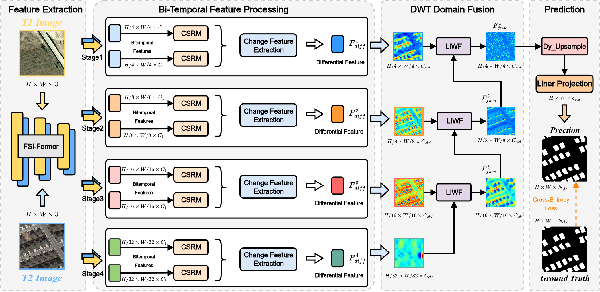
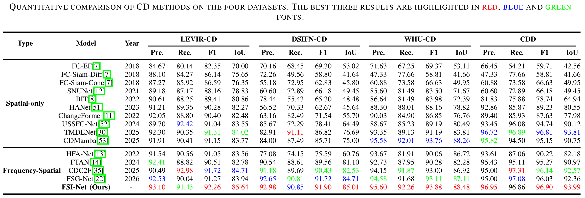

## FSI-Net: Frequency–Spatial Interaction Transformer for Subtle Change Detection in Remote Sensing
> [FSI-Net: Frequency–Spatial Interaction Transformer for Subtle Change Detection in Remote Sensing](https://arxiv.org/xxxx)


## Network Architecture


## Quantitative & Qualitative Results on LEVIR-CD, DSIFN-CD, WHU-CD and CDD 


# Usage
## Requirements

```
Python 3.9.21
pytorch 2.1.2
torchvision 0.16.2
einops  0.8.0
mmcv 2.1.0
mmdet 3.3.0
mmengine 0.10.1
mmsegmentation 1.2.2
opencv-python 4.10.0.84
```

- Please see `requirements.txt` for all the other requirements.

## Setting up conda environment: 

Create a virtual ``conda`` environment named ``py212cu118`` with the following command:

```bash
conda create --name pt212cu118 --file requirements.txt
conda activate pt212cu118
```

## Installation

Clone this repo:

```shell
git clone https://github.com/UCAS-ChenZC/FSI-Net.git
cd FSI-Net
```

## Training on LEVIR-CD
You can download the pre-trained model [`Github-Pretrained`](https://pan.baidu.com/s/1uTSCuPqYRNmT4Zb4Je9BOw?pwd=vsyv).

#Then, update the path to the pre-trained model by updating the ``path`` argument in the ``run_ChangeFormer_LEVIR.sh``.
#Here:
#https://github.com/wgcban/ChangeFormer/blob/a3eca2b1ec5d0d2628ea2e0b6beae85630ba79d4/scripts/run_ChangeFormer_LEVIR.sh#L28

#You can find the training script `run_ChangeFormer_LEVIR.sh` in the folder `scripts`. You can run the script file by `sh scripts/run_ChangeFormer_LEVIR.sh` in the command environment.

The detailed script file `run_FSI-Net_LEVIR.sh` is as follows:

```cmd
#!/usr/bin/env bash

#GPUs
gpus=0

#Set paths
checkpoint_root=/media/lidan/ssd2/ChangeFormer/checkpoints
vis_root=/media/lidan/ssd2/ChangeFormer/vis
data_name=LEVIR


img_size=256    
batch_size=8   
lr=0.0001         
max_epochs=200
embed_dim=256

net_G=FSI-Former        #FSI-Former is the finalized verion

lr_policy=linear
optimizer=adamw                 #Choices: sgd (set lr to 0.01), adam, adamw
loss=ohem                         #Choices: ce, fl (Focal Loss), miou
multi_scale_train=True
multi_scale_infer=False
shuffle_AB=False

#Initializing from pretrained weights
pretrain=/media/lidan/ssd2/ChangeFormer/pretrained_segformer/segformer.b2.512x512.ade.160k.pth

#Train and Validation splits
split=train         #train
split_val=test      #test, val
project_name=CD_${net_G}_${data_name}_b${batch_size}_lr${lr}_${optimizer}_${split}_${split_val}_${max_epochs}_${lr_policy}_${loss}_multi_train_${multi_scale_train}_multi_infer_${multi_scale_infer}_shuffle_AB_${shuffle_AB}_embed_dim_${embed_dim}

CUDA_VISIBLE_DEVICES=1 python main_cd.py --img_size ${img_size} --loss ${loss} --checkpoint_root ${checkpoint_root} --vis_root ${vis_root} --lr_policy ${lr_policy} --optimizer ${optimizer} --pretrain ${pretrain} --split ${split} --split_val ${split_val} --net_G ${net_G} --multi_scale_train ${multi_scale_train} --multi_scale_infer ${multi_scale_infer} --gpu_ids ${gpus} --max_epochs ${max_epochs} --project_name ${project_name} --batch_size ${batch_size} --shuffle_AB ${shuffle_AB} --data_name ${data_name}  --lr ${lr} --embed_dim ${embed_dim}
```

## Training on DSIFN-CD

Follow the similar procedure mentioned for LEVIR-CD. Use `run_ChangeFormer_DSIFN.sh` in `scripts` folder to train on DSIFN-CD.

## Evaluate on LEVIR

You can find the evaluation script `eval_ChangeFormer_LEVIR.sh` in the folder `scripts`. You can run the script file by `sh scripts/eval_ChangeFormer_LEVIR.sh` in the command environment.

The detailed script file `eval_ChangeFormer_LEVIR.sh` is as follows:

```cmd
#!/usr/bin/env bash

gpus=0

data_name=LEVIR
net_G=FSI-Former #This is the best version
split=test
project_name=FSI-Former_test
checkpoints_root=/media/lidan/ssd2/FSI-Former/checkpoints
checkpoint_name=best_ckpt.pt
img_size=256
embed_dim=256 #Make sure to change the embedding dim (best and default = 256)

CUDA_VISIBLE_DEVICES=0 python eval_cd.py --split ${split} --net_G ${net_G} --embed_dim ${embed_dim} --img_size ${img_size} --vis_root ${vis_root} --checkpoints_root ${checkpoints_root} --checkpoint_name ${checkpoint_name} --gpu_ids ${gpus} --project_name ${project_name} --data_name ${data_name}
```

## Evaluate on DSIFN

Follow the same evaluation procedure mentioned for LEVIR-CD. You can find the evaluation script `eval_ChangeFormer_DSFIN.sh` in the folder `scripts`. You can run the script file by `sh scripts/eval_ChangeFormer_DSIFN.sh` in the command environment.

### Dataset Preparation

## Data structure

```
Change detection data set with pixel-level binary labels；
├─A
├─B
├─label
└─list
```

`A`: images of t1 phase;

`B`:images of t2 phase;

`label`: label maps;

`list`: contains `train.txt, val.txt and test.txt`, each file records the image names (XXX.png) in the change detection dataset.

## Links to processed datsets used for train/val/test

You can download the processed `LEVIR-CD` and `DSIFN-CD` datasets by the DropBox through the following here:

- LEVIR-CD-256: [`click here to download`](https://www.dropbox.com/s/18fb5jo0npu5evm/LEVIR-CD256.zip)
- DSIFN-CD-256: [`click here to download`](https://www.dropbox.com/s/18fb5jo0npu5evm/LEVIR-CD256.zip)

Since the file sizes are large, I recommed to use command line and cosider downloading the zip file as follows (in linux):

To download LEVIR-CD dataset run following command in linux-terminal:
```cmd
wget https://www.dropbox.com/s/18fb5jo0npu5evm/LEVIR-CD256.zip
```
To download DSIFN-CD dataset run following command in linux-terminal:
```cmd
wget https://www.dropbox.com/s/18fb5jo0npu5evm/LEVIR-CD256.zip
```

For your reference, I have also attached the inks to original LEVIR-CD and DSIFN-CD here: [`LEVIR-CD`](https://justchenhao.github.io/LEVIR/) and [`DSIFN-CD`](https://github.com/GeoZcx/A-deeply-supervised-image-fusion-network-for-change-detection-in-remote-sensing-images/tree/master/dataset).

### Other useful notes

### License

Code is released for non-commercial and research purposes **only**. For commercial purposes, please contact the authors.

### Citation

If you use this code for your research, please cite our paper:

""

## Disclaimer
Appreciate the work from the following repositories:
-  (Our FSI-Net is implemented on the code provided in this repository)

